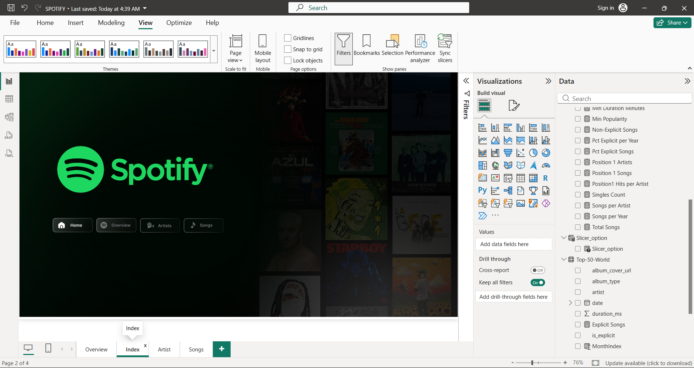
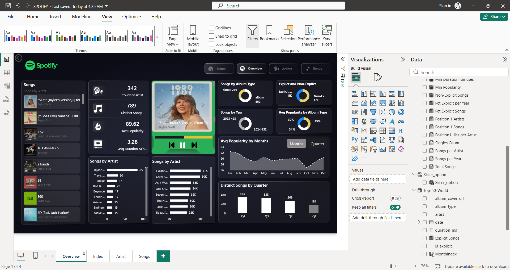
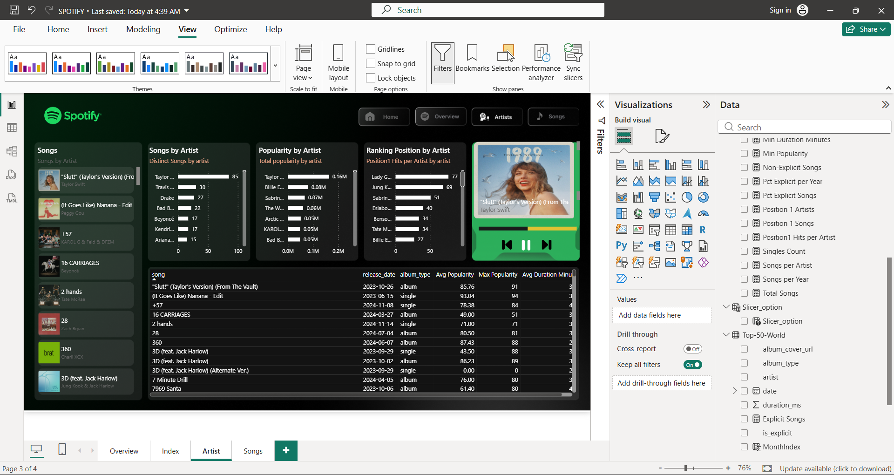
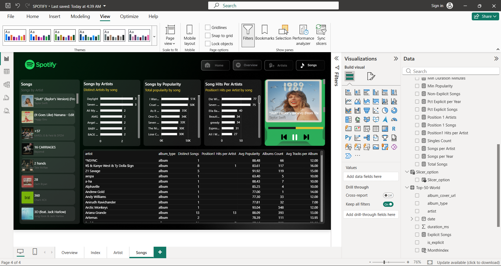

# spotify-music-analytics

Interactive Spotify Music Analytics project using Python, PostgreSQL,
SQL, DAX, and Power BI.

# 🎵 Spotify Music Analytics

## 🚀 Project Overview

The Spotify Music Analytics project is an end-to-end Data Analyst
project designed to analyze Spotify Top-50-world chart data and
transform raw music data into actionable performance insights.

The project analyzes song popularity, artist performance, chart
rankings, album characteristics, explicit-content patterns, song
duration, and popularity trends over time.

The complete workflow covers data cleaning, exploratory data analysis,
PostgreSQL database integration, SQL business analysis, DAX KPI
development, interactive Power BI dashboard development, and business
insight generation.

------------------------------------------------------------------------

## 🎯 Business Objective

The primary objective of this project is to understand music performance
and answer business questions such as:

-   Which artists have the strongest chart presence and performance?
-   Which songs achieve the highest popularity and chart performance?
-   How does popularity differ between singles, albums, and
    compilations?
-   How do explicit and non-explicit songs compare?
-   What are the typical song-duration patterns?
-   How does popularity change across months, quarters, and years?
-   What is the relationship between chart position and popularity?
-   Which artists and songs demonstrate strong performance?

------------------------------------------------------------------------

## 📂 Dataset Information

The Spotify Top-50-world dataset contains:

  Metric                           Value
  ----------------------- --------------
  Total Records                   27,800
  Distinct Songs                     794
  Distinct Artists                   343
  Average Popularity               89.62
  Average Song Duration     3.28 minutes

### Main Features

-   Song
-   Artist
-   Popularity
-   Chart Position
-   Duration
-   Album Type
-   Total Tracks
-   Release Date
-   Explicit Status
-   Chart Date

------------------------------------------------------------------------

## 🧹 Data Cleaning & Preparation

Data cleaning and preparation were performed using Python and Pandas.

The project includes:

-   Loading the Spotify dataset using Pandas
-   Checking dataset structure and data types
-   Checking missing values
-   Checking duplicate records
-   Converting chart date and release date into datetime format
-   Creating year, month, and quarter fields
-   Converting `duration_ms` into `duration_minutes`
-   Saving the prepared dataset as `spotify_cleaned.csv`

The cleaned dataset contains 27,800 records across 11 columns, with all
columns containing 27,800 non-null values and no duplicate records
detected.

------------------------------------------------------------------------

## 🔍 Exploratory Data Analysis (EDA)

Python EDA was used to analyze:

-   Total records
-   Distinct songs
-   Distinct artists
-   Average popularity
-   Average song duration
-   Artist presence
-   Song popularity
-   Album-type performance
-   Explicit and non-explicit content
-   Song duration
-   Distinct songs by year
-   Average popularity by month
-   Correlations between chart position, popularity, duration, and total
    tracks

### Important EDA Results

-   Average popularity: **89.62**
-   Average song duration: **3.28 minutes**
-   Distinct songs in 2023: **425**
-   Distinct songs in 2024: **453**
-   Average popularity of singles: **91.86**
-   Average popularity of albums: **88.30**
-   Average popularity of compilations: **76.26**
-   Position vs popularity correlation: **-0.141826**

------------------------------------------------------------------------

## 🗄️ PostgreSQL & SQL Analysis

The cleaned dataset was loaded into PostgreSQL using the table:

``` text
top_50_world
```

The PostgreSQL database was verified with **27,800 records**.

SQL analysis includes:

-   Aggregation
-   Filtering
-   Sorting
-   Artist rankings
-   Song rankings
-   Popularity analysis
-   Album-type comparisons
-   Explicit/non-explicit analysis
-   Duration analysis
-   Subqueries
-   Window functions
-   Time-based analysis

The SQL analysis was designed around the project's business questions
and dashboard requirements.

------------------------------------------------------------------------

## 📊 Power BI Dashboard

An interactive Power BI dashboard was developed to present the analysis.

### Dashboard Pages

#### 🏠 Home / Index

Provides the main navigation area for the dashboard.

#### 📈 Overview

Includes:

-   Artist count
-   Distinct song count
-   Average popularity
-   Average duration
-   Songs by album type
-   Explicit vs non-explicit records
-   Songs by year
-   Average popularity by month
-   Distinct songs by quarter
-   Song and artist-level views

#### 🎤 Artist Analysis

Includes:

-   Songs by artist
-   Popularity by artist
-   Ranking positions by artist
-   Artist performance table
-   Song-level details for selected artists

#### 🎵 Songs Analysis

Includes:

-   Songs by artist
-   Songs by popularity
-   Song hits by artist
-   Detailed song performance table
-   Artist, album type, popularity, duration, and ranking information

### Dashboard Screenshots

### Home / Index



### Overview



### Artist Analysis



### Songs Analysis



------------------------------------------------------------------------

## 📐 DAX & KPI Analysis

DAX measures were developed in Power BI for analytical KPIs and
comparisons.

The dashboard includes measures for:

-   Total Songs
-   Distinct Songs
-   Distinct Artists
-   Average Popularity
-   Popularity by Album Type
-   Explicit/Non-Explicit comparisons
-   Duration metrics
-   Position-1 metrics
-   Time-based measures

------------------------------------------------------------------------

## 💡 Key Business Insights

### 1. Artist Performance

Taylor Swift has the highest chart-record presence in the analyzed
dataset with **1,871 observations**, followed by Billie Eilish with
**860** and Sabrina Carpenter with **736**.

### 2. Overall Popularity

The dataset has an average popularity of **89.62**.

### 3. Album Type Performance

Singles have the highest average popularity at **91.86**, compared with
**88.30** for albums and **76.26** for compilations.

### 4. Content Mix

Non-explicit records represent **16,628** of the 27,800 chart records.

### 5. Song Duration

The average song duration is **3.28 minutes**.

### 6. Yearly Song Coverage

The dataset contains **425 distinct songs in 2023** and **453 distinct
songs in 2024**.

### 7. Monthly Popularity

Average popularity varies across months. In the EDA results, January has
an average popularity of **92.48**, while October has **86.94**.

### 8. Chart Position and Popularity

The correlation between chart position and popularity is **-0.141826**,
indicating a weak negative relationship in the analyzed dataset.

------------------------------------------------------------------------

## 🔄 Project Workflow

``` text
Spotify Chart Data
        ↓
Python Data Cleaning
        ↓
Exploratory Data Analysis
        ↓
Cleaned Dataset
        ↓
PostgreSQL Database
        ↓
SQL Business Analysis
        ↓
DAX KPI Development
        ↓
Power BI Dashboard
        ↓
Business Insights
```

------------------------------------------------------------------------

## 🛠️ Technologies Used

  Technology         Purpose
  ------------------ ---------------------------
  Python             Data Cleaning & EDA
  Pandas             Data Manipulation
  NumPy              Numerical Analysis
  PostgreSQL         Database Management
  SQL                Business Analysis
  DAX                KPI & Analytical Measures
  Power BI           Interactive Dashboard
  Jupyter Notebook   Analysis Environment
  Git & GitHub       Project Version Control

------------------------------------------------------------------------

## 📁 Project Structure

``` text
spotify-music-analytics/
│
├── README.md
│

│
├── spotify_cleaned.csv
├── spotify_analysis.sql
├── Spotify Music Analytics(EDA) (2).ipynb
├── Spotify-Music-Analytics-Insights.pptx
├── Spotify_Business_Problem_Statement.pdf
└── Spotify_Business_Insights.pdf
```

------------------------------------------------------------------------

## ▶️ How to Run

### Step 1: Install Python Libraries

``` bash
pip install pandas numpy matplotlib seaborn sqlalchemy psycopg2-binary
```

### Step 2: Run the EDA Notebook

Open Jupyter Notebook:

``` bash
jupyter notebook
```

Open:

``` text
Spotify Music Analytics(EDA) (2).ipynb
```

The notebook performs data preparation, EDA, feature engineering, and
PostgreSQL integration.

### Step 3: PostgreSQL Setup

Create a PostgreSQL database for the project and load the cleaned
dataset into the:

``` text
top_50_world
```

table.

Execute:

``` text
spotify_analysis.sql
```

to perform the SQL-based business analysis.

### Step 4: Open the Power BI Dashboard

Open the Power BI file:

``` text
Spotify-Music-Analytics.pbix
```

Refresh the data source if required and explore the dashboard pages.

------------------------------------------------------------------------

## 📦 Project Deliverables

-   Cleaned Spotify dataset
-   Python EDA notebook
-   PostgreSQL SQL analysis
-   Power BI dashboard
-   Business Problem Statement
-   Business Insights document
-   Project presentation
-   Dashboard screenshots

------------------------------------------------------------------------

## 💼 Skills Demonstrated

-   Data Cleaning
-   Exploratory Data Analysis
-   Python & Pandas
-   SQL
-   PostgreSQL
-   Data Aggregation
-   Ranking & Window Functions
-   DAX
-   KPI Development
-   Power BI
-   Interactive Dashboard Development
-   Business Analysis
-   Data Visualization
-   Business Insight Generation
-   Data Storytelling

------------------------------------------------------------------------

## 🎓 Learning Outcomes

This project demonstrates the practical application of an end-to-end
Data Analyst workflow using real-world-style music chart data.

It shows how raw data can be cleaned and explored in Python, structured
and analyzed using PostgreSQL and SQL, transformed into KPIs using DAX,
and presented through an interactive Power BI dashboard for
business-oriented analysis.

------------------------------------------------------------------------

## 👨‍💻 Author

**Tarun Reddy B**

B.Tech -- Artificial Intelligence & Data Science

### Connect With Me

-   LinkedIn:
    [www.linkedin.com/in/tarunreddy-b-184214385](https://www.linkedin.com/in/tarunreddy-b-184214385)
-   GitHub:
    [github.com/TARUNREDDY1807](https://github.com/TARUNREDDY1807)

------------------------------------------------------------------------

⭐ If you found this project useful, consider giving it a star on
GitHub!
